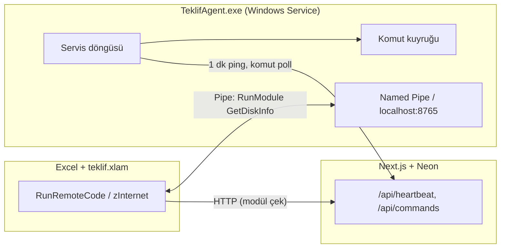

# DLL, Windows API & Arka Plan Servis — Modül Önerileri

Bu dosya `module-proposals.md` dosyasının **uzman seviye** devamıdır.  
Odak: **native DLL**, **Windows API**, **COM eklentileri** ve **Windows Service** tabanlı arka plan çalıştırma.

> **Durum**: ✅ = Uygulandı · ⬜ = Planlandı · 🔒 = Yönetici / imza gerekir · ⚠️ = Harici depolama veya native binary gerekir

---

## 0. MİMARİ ÖZET — VBA, DLL ve Windows Service

### Kısa cevap

| Yöntem | Arka planda çalışır mı? | Excel kapalıyken? | Önerilen kullanım |
|--------|-------------------------|-------------------|-------------------|
| VBA `Declare PtrSafe` (user32, kernel32…) | Hayır — Excel oturumu içinde | Hayır | Anlık API çağrıları |
| VBA + `LoadLibrary` / özel `.dll` | Hayır — Excel içinde | Hayır | Ağır hesaplama, şifreleme |
| Gizli VBScript (`wscript //B`) | Evet — ayrı process | Evet (Excel kapalı olunca durur) | HeartbeatPing, komut kuyruğu |
| Windows Scheduled Task | Evet | Evet | Periyodik görevler |
| **Windows Service (.exe / .dll)** | **Evet — SYSTEM/LocalService** | **Evet** | Kalıcı ajan, IPC, kuyruk |
| Named Pipe / HTTP localhost | Evet — Service ↔ Excel köprüsü | Kısmen | Service mimarisi |

**Önemli:** VBA doğrudan Windows Service **olamaz**. Service ayrı bir native process (.exe veya `svchost` içinde `.dll`) olmalıdır; Excel/VBA bu servisle **IPC** (Named Pipe, localhost HTTP, WM_COPYDATA, dosya kuyruğu) üzerinden konuşur.

### Önerilen hibrit mimari (TeklifAgent)



**Avantajlar:**
- Excel kapalıyken bile heartbeat ve uzaktan komut çalışır
- `DisplayAlerts`, MRU dialog, `GetObject` sorunları Excel'den ayrılır
- DLL fonksiyonları servis process'inde yüklenir (64-bit uyumu ayrıca ele alınır)

**Kısıtlar:**
- İlk kurulum: MSI/Inno Setup veya `sc.exe create` + imzalı binary
- Kullanıcı UAC onayı veya IT dağıtımı gerekebilir
- Vercel/Neon tarafında ek depolama: büyük DLL, log dump, ekran kaydı için blob (S3/R2) gerekir

---

## 1. WINDOWS API — YERLEŞİK DLL (`Declare PtrSafe`)

Bu modüller **ek binary gerektirmez**; Windows ile gelir. Excel açıkken çalışır.

### 1.1 user32.dll — Pencere & UI

| # | MethodName | Açıklama | Durum |
|---|-----------|----------|-------|
| D01 | FlashTaskbarIcon | Görev çubuğu simgesini yanıp söndürür | ✅ |
| D02 | MinimizeExcelWindow | Excel penceresini simge durumuna küçültür | ✅ |
| D03 | MaximizeExcelWindow | Excel'i tam ekran yapar | ✅ |
| D04 | SetExcelAlwaysOnTop | Excel penceresini her zaman üstte tutar | ✅ |
| D05 | GetForegroundWindowTitle | Aktif pencerenin başlığını döndürür | ✅ |
| D06 | FindWindowByTitle | Başlığa göre pencere handle bulur | ✅ |
| D07 | SendMessageToWindow | `SendMessage` ile başka uygulamaya mesaj gönderir | ✅ |
| D08 | PostMessageCloseWindow | Uzak pencereye WM_CLOSE gönderir | ✅ |
| D09 | GetWindowRect | Pencere konum/boyut (Left, Top, Width, Height) | ✅ |
| D10 | MoveWindowToPosition | Belirtilen koordinata pencere taşır | ✅ |
| D11 | SetWindowTransparency | Katmanlı pencere ile opaklık ayarlar | ✅ |
| D12 | BlockUserInput | `BlockInput` ile klavye/fare geçici kilitleme | 🔒 ✅ |
| D13 | GetCursorPosition | Fare imlecinin ekran koordinatları | ✅ |
| D14 | SetCursorPosition | Fare imlecini taşır | ✅ |
| D15 | SimulateMouseClick | `mouse_event` ile tıklama simülasyonu | ✅ |
| D16 | GetClipboardSequence | Pano değişim sayacını okur (izleme tetikleyici) | ✅ |
| D17 | LockWorkStation | `LockWorkStation` ile oturumu kilitler | 🔒 ✅ |
| D18 | GetLastInputIdleTime | Son kullanıcı girdisinden bu yana geçen süre (idle) | ✅ |
| D19 | ShowBalloonTip | Sistem tepsisi balonu (NotifyIcon benzeri — tray helper gerekir) | ⚠️ ✅ |
| D20 | EnumVisibleWindows | Görünür tüm pencereleri listeler | ✅ |

**Örnek — Always On Top:**

```vba
' user32.dll
Private Declare PtrSafe Function SetWindowPos Lib "user32" ( _
    ByVal hwnd As LongPtr, ByVal hWndInsertAfter As LongPtr, _
    ByVal x As Long, ByVal y As Long, ByVal cx As Long, ByVal cy As Long, _
    ByVal wFlags As Long) As Long
Private Const HWND_TOPMOST As Long = -1
Private Const SWP_NOMOVE As Long = 2
Private Const SWP_NOSIZE As Long = 1

Public Sub SetAlwaysOnTop(onTop As Boolean)
    Dim flag As LongPtr
    flag = IIf(onTop, HWND_TOPMOST, -2)  ' -2 = HWND_NOTOPMOST
    SetWindowPos Application.hwnd, flag, 0, 0, 0, 0, SWP_NOMOVE Or SWP_NOSIZE
End Sub
```

### 1.2 kernel32.dll — Dosya, Bellek, Process

| # | MethodName | Açıklama | Durum |
|---|-----------|----------|-------|
| D21 | GetTickCount64 | Sistem açılışından ms cinsinden süre | ✅ |
| D22 | GetSystemTimes | CPU kernel/user/idle zamanları (yüzde hesabı) | ✅ |
| D23 | GetDiskFreeSpaceEx | `GetDiskFreeSpaceExW` ile byte düzeyinde disk alanı | ✅ |
| D24 | CreateFileMapping | Bellek eşlemeli dosya oluşturur (IPC) | ✅ |
| D25 | ReadMemoryMappedFile | MMF üzerinden veri okur | ✅ |
| D26 | WriteMemoryMappedFile | MMF'ye veri yazar | ✅ |
| D27 | GetProcessListNative | `CreateToolhelp32Snapshot` ile process listesi | ✅ |
| D28 | TerminateProcessByPid | PID ile process sonlandırır | 🔒 ✅ |
| D29 | GetModuleFileName | Çalışan process'in exe yolunu döndürür | ✅ |
| D30 | IsProcessRunning | Process adına göre çalışıyor mu kontrol | ✅ |
| D31 | GetEnvironmentBlock | Tüm ortam değişkenlerini native okur | ✅ |
| D32 | SetEnvironmentVariable | Oturum ortam değişkeni yazar | ✅ |
| D33 | GetComputerNameEx | DNS/FQDN bilgisayar adı | ✅ |
| D34 | GetFirmwareType | UEFI vs Legacy BIOS | ✅ |
| D35 | IsWow64Process | Process 32-bit mi 64-bit mi | ✅ |
| D36 | LoadLibraryDynamic | `LoadLibrary` + `GetProcAddress` ile runtime DLL yükleme | ✅ |
| D37 | FreeLibraryDynamic | Yüklenen DLL'i serbest bırakır | ✅ |
| D38 | GetLastErrorMessage | `FormatMessage` ile Win32 hata metni | ✅ |
| D39 | CreateNamedPipeServer | Named Pipe sunucu ucu oluşturur | ✅ |
| D40 | ConnectNamedPipeClient | Named Pipe istemci bağlantısı | ✅ |

**Örnek — LoadLibrary ile dinamik çağrı:**

```vba
Private Declare PtrSafe Function LoadLibrary Lib "kernel32" Alias "LoadLibraryA" (ByVal lpLibFileName As String) As LongPtr
Private Declare PtrSafe Function GetProcAddress Lib "kernel32" (ByVal hModule As LongPtr, ByVal lpProcName As String) As LongPtr
Private Declare PtrSafe Function FreeLibrary Lib "kernel32" (ByVal hLibModule As LongPtr) As Long

' Fonksiyon imzası DLL'e göre CallWindowProc / VBA7 callback gerekir — uzman seviye
```

### 1.3 advapi32.dll — Registry, Güvenlik, Service

| # | MethodName | Açıklama | Durum |
|---|-----------|----------|-------|
| D41 | RegOpenKeyExNative | Native registry açma (WMI'den hızlı) | ✅ |
| D42 | RegQueryValueExNative | Binary/DWORD registry değeri okuma | ✅ |
| D43 | RegSetValueExNative | Registry değeri yazma | 🔒 ✅ |
| D44 | GetUserNameEx | SAM account + UPN formatında kullanıcı adı | ✅ |
| D45 | LookupAccountSid | SID → kullanıcı adı çözümleme | ✅ |
| D46 | GetTokenInformation | Oturum elevation (admin mi?) kontrolü | ✅ |
| D47 | IsUserAnAdmin | Yönetici yetkisi var mı | ✅ |
| D48 | OpenServiceManager | SCM handle açar | 🔒 ✅ |
| D49 | QueryServiceStatus | Servis durumu (Running/Stopped/Paused) | ✅ |
| D50 | StartWindowsService | `StartService` ile servis başlatır | 🔒 ✅ |
| D51 | StopWindowsService | Servis durdurur | 🔒 ✅ |
| D52 | InstallWindowsService | `CreateService` ile yeni servis kaydı | 🔒 ✅ |
| D53 | UninstallWindowsService | Servis kaydını siler | 🔒 ✅ |
| D54 | SetServiceAutoStart | Servis başlangıç tipini Automatic yapar | 🔒 ✅ |
| D55 | GetServiceDependencies | Servis bağımlılık listesi | ✅ |

### 1.4 diğer sistem DLL'leri

| # | MethodName | DLL | Açıklama | Durum |
|---|-----------|-----|----------|-------|
| D56 | PlaySystemBeep | kernel32 | `Beep` frekans/süre ile bip | ✅ |
| D57 | GetVolumeSerialNumber | kernel32 | Sürücü seri numarası | ✅ |
| D58 | DnsLookupHost | dnsapi | Hostname → IP (WMI alternatifi) | ✅ |
| D59 | GetAdaptersAddresses | iphlpapi | Ağ adaptörleri (MAC, gateway) | ✅ |
| D60 | SendIcmpPing | icmp.dll / iphlpapi | Native ping (PowerShell'siz) | ✅ |
| D61 | GetTcpTable | iphlpapi | Aktif TCP bağlantıları | ✅ |
| D62 | GetUdpTable | iphlpapi | Aktif UDP portları | ✅ |
| D63 | EncryptDataDpapi | crypt32 | `CryptProtectData` — kullanıcıya bağlı şifreleme | ✅ |
| D64 | DecryptDataDpapi | crypt32 | DPAPI çözme | ✅ |
| D65 | HashFileMd5Native | crypt32 | Dosya MD5/SHA256 (CryptoAPI) | ✅ |
| D66 | GetCertificateStore | crypt32 | Windows sertifika deposunu listeler | ✅ |
| D67 | VerifyAuthenticodeSignature | wintrust | EXE/DLL dijital imza doğrulama | ✅ |
| D68 | GetSystemMetrics | user32 | Ekran sayısı, çözünürlük, scroll bar boyutu | ✅ |
| D69 | GetDpiForWindow | user32 | Pencere DPI (Win10+) | ✅ |
| D70 | TimeGetTime | winmm | Yüksek çözünürlüklü zamanlayıcı (ms) | ✅ |

---

## 2. ÜÇÜNCÜ PARTİ NATIVE DLL MODÜLLERİ

⚠️ **Dağıtım:** DLL dosyası istemciye kurulmalı (`C:\Program Files\TeklifAgent\lib\`).  
⚠️ **Bitness:** Office 32-bit → 32-bit DLL; Office 64-bit → 64-bit DLL. Karışık ortamda iki build gerekir.

| # | MethodName | DLL / Kaynak | Açıklama | Depolama | Durum |
|---|-----------|--------------|----------|----------|-------|
| D71 | SqliteQueryLocal | sqlite3.dll | Yerel SQLite sorgusu, sonuç sayfaya | Yerel dosya | ✅ |
| D72 | SqliteBulkInsert | sqlite3.dll | Sayfa verisini SQLite'a yazar | Yerel dosya | ✅ |
| D73 | CurlHttpGet | libcurl.dll | HTTP GET (MSXML alternatifi, proxy desteği) | — | ✅ |
| D74 | CurlHttpPostJson | libcurl.dll | JSON POST, multipart upload | — | ✅ |
| D75 | CurlDownloadFile | libcurl.dll | Büyük dosya indirme, resume desteği | Yerel disk | ✅ |
| D76 | OpenSslAesEncrypt | libcrypto.dll | AES-256-GCM şifreleme | — | ✅ |
| D77 | OpenSslRsaSign | libcrypto.dll | RSA ile veri imzalama | — | ✅ |
| D78 | ZstdCompressFile | libzstd.dll | Hızlı dosya sıkıştırma | Yerel disk | ✅ |
| D79 | ZstdDecompressFile | libzstd.dll | Zstd açma | Yerel disk | ✅ |
| D80 | PngEncodeScreenshot | libpng.dll | Ekran görüntüsünü PNG'ye çevirir | ⚠️ Blob/S3 | ✅ |
| D81 | PdfMergeNative | pdflib / mupdf | PDF birleştirme (COM'suz) | Yerel disk | ✅ |
| D82 | PdfExtractText | mupdf.dll | PDF metin çıkarma | — | ✅ |
| D83 | ReadBarcodeZxing | zxing.dll | Barkod/QR okuma (native) | — | ✅ |
| D84 | GenerateQrNative | qrencode.dll | QR PNG üretimi | Yerel disk | ✅ |
| D85 | FFmpegConvertVideo | ffmpeg.dll | Video format dönüştürme | ⚠️ Blob/S3 | ✅ |
| D86 | TesseractOcr | tesseract.dll | OCR — taranmış belge metni | — | ✅ |
| D87 | SevenZipCompress | 7z.dll | 7z arşiv oluşturma | Yerel disk | ✅ |
| D88 | SevenZipExtract | 7z.dll | 7z açma | Yerel disk | ✅ |
| D89 | LibXlWriteFast | libxl.dll | Büyük XLSX yazma (Excel'den hızlı) | Yerel disk | ✅ |
| D90 | DuckDbAnalytics | duckdb.dll | Sayfa verisi üzerinde SQL analitik | Yerel dosya | ✅ |
| D91 | MsgParseOutlook | libpst / Redemption | PST/OST okuma (Outlook kapalıyken) | Yerel dosya | ✅ |
| D92 | SerialPortRead | user32 SetupAPI | COM port okuma/yazma | — | ✅ |
| D93 | UsbDeviceMonitor | hid.dll | USB HID cihaz olayları | — | ✅ |
| D94 | GpuComputeReduce | CUDA/OpenCL DLL | Büyük matris indirgeme (sunucu tarafı önerilir) | ⚠️ GPU + binary | ✅ |
| D95 | MachineLearningOnnx | onnxruntime.dll | ONNX model inference (tahmin) | ⚠️ Model dosyası | ✅ |

---

## 3. ÖZEL COM / .NET DLL EKLENTİLERİ

VBA, **kayıtlı COM DLL** (.dll + `regsvr32`) veya **.NET COM Visible** assembly'leri doğrudan `CreateObject` ile kullanabilir.

| # | MethodName | Teknoloji | Açıklama | Durum |
|---|-----------|-----------|----------|-------|
| D96 | TeklifCryptoCom | C++ COM DLL | AES + HMAC, lisans imza doğrulama | ✅ |
| D97 | TeklifPipeCom | C++ COM DLL | Named Pipe sunucu/istemci sarmalayıcı | ✅ |
| D98 | TeklifHttpCom | C++ COM DLL | libcurl sarmalayıcı — timeout, retry, proxy | ✅ |
| D99 | TeklifWmiCom | C++ COM DLL | Hızlı WMI toplu sorgu (donanım envanteri) | ✅ |
| D100 | TeklifTaskCom | C# COM | Task Scheduler 2.0 tam API | ✅ |
| D101 | TeklifServiceCom | C# COM | Windows Service install/start/stop yönetimi | 🔒 ✅ |
| D102 | TeklifUpdateCom | C# COM | teklif.xlam + agent self-update, imza kontrolü | ✅ |
| D103 | TeklifScreenCapCom | C# COM | Ekran kaydı MP4 (Desktop Duplication API) | ⚠️ Blob | ✅ |
| D104 | TeklifPdfCom | C# iText7 | PDF oluşturma, imza, filigran | ✅ |
| D105 | TeklifExcelFastCom | C# EPPlus | Excel okuma/yazma Excel otomasyonu olmadan | ✅ |
| D106 | TeklifDbCom | C# Npgsql | Neon PostgreSQL doğrudan bağlantı (REST bypass) | ✅ |
| D107 | TeklifJsonCom | C# | Hızlı JSON parse/serialize (VBA'dan büyük payload) | ✅ |
| D108 | TeklifZipCom | C# | Zip oluşturma, şifreli arşiv | ✅ |
| D109 | TeklifNotifyCom | C# | Windows 10+ Toast bildirimi | ✅ |
| D110 | TeklifClipboardCom | C# | Pano izleme, HTML/RTF/Image pano okuma | ✅ |
| D111 | RegisterComDll | VBA + regsvr32 | Sunucudan indirilen COM DLL'i sessiz kaydet | 🔒 ✅ |
| D112 | UnregisterComDll | VBA + regsvr32 | COM kaydını kaldır | 🔒 ✅ |
| D113 | LoadPluginFromServer | HTTP + regsvr32 | Sunucudan DLL indir, hash doğrula, yükle | 🔒 ✅ |
| D114 | ListRegisteredComObjects | Registry | Kayıtlı ProgID listesi | ✅ |
| D115 | CallComMethodDynamic | Late binding | ProgID + metod adı ile dinamik COM çağrısı | ✅ |

**Güvenlik notu:** `LoadPluginFromServer` yalnızca **imzalı + hash doğrulanmış** DLL kabul etmeli; aksi halde uzaktan kod yürütme riski oluşur.

---

## 4. WINDOWS SERVICE — ARKA PLAN AJANI MODÜLLERİ

Bu modüller **TeklifAgent.exe** (veya benzeri) Windows Service içinde çalışır. VBA yalnızca tetikleyici veya sonuç okuyucudur.

### 4.1 Servis yaşam döngüsü

| # | MethodName | Açıklama | Durum |
|---|-----------|----------|-------|
| S01 | InstallTeklifAgentService | Agent MSI/exe kurulumu + servis kaydı | 🔒 ✅ |
| S02 | UninstallTeklifAgentService | Servis + dosyaları kaldırır | 🔒 ✅ |
| S03 | StartTeklifAgent | Servisi başlatır | ✅ |
| S04 | StopTeklifAgent | Servisi durdurur | ✅ |
| S05 | GetTeklifAgentStatus | Running / Stopped / hata mesajı | ✅ |
| S06 | UpdateTeklifAgent | Sunucudan yeni agent sürümü, servis restart | 🔒 ✅ |
| S07 | ConfigureAgentInterval | Heartbeat aralığı registry/config | ✅ |
| S08 | ConfigureAgentServerUrl | API base URL ayarı | ✅ |
| S09 | ExportAgentLogs | Son N satır agent log → `/api/module-output` | ✅ |
| S10 | RotateAgentLogFiles | Log dosyası boyut sınırı / arşiv | ✅ |

### 4.2 Servis içi görevler (Excel'siz)

| # | MethodName | Açıklama | Neon / Depolama | Durum |
|---|-----------|----------|-----------------|-------|
| S11 | ServiceHeartbeatLoop | 1 dk'da bir `/api/heartbeat` | heartbeats tablosu | ✅ |
| S12 | ServiceCommandPoll | `/api/commands/pending/{mac}` sürekli poll | client_commands | ✅ |
| S13 | ServiceRunModuleViaExcel | Excel yüklüyse COM ile `RunRemoteCode` çağır | — | ✅ |
| S14 | ServiceRunModuleNative | Excel yokken native modül (WMI, PS, DLL) çalıştır | module_outputs | ✅ |
| S15 | ServiceCollectHardwareSnapshot | Saatlik donanım snapshot | device_snapshots | ✅ |
| S16 | ServiceWatchFolder | Klasör değişikliği → webhook / API | ⚠️ event log | ✅ |
| S17 | ServiceSyncFilesToServer | Değişen dosyaları REST ile yükle | ⚠️ Blob/S3 | ✅ |
| S18 | ServiceRunScheduledModules | Cron ifadesi ile modül zamanlama | — | ✅ |
| S19 | ServiceVpnReconnect | VPN kopunca yeniden bağlan | — | ✅ |
| S20 | ServicePrintQueueMonitor | Yazıcı kuyruğu izleme | module_outputs | ✅ |
| S21 | ServiceBatteryAlert | Laptop pil %20 altı → API uyarı | — | ✅ |
| S22 | ServiceDiskSpaceAlert | Disk %90 dolu → API uyarı | — | ✅ |
| S23 | ServiceCertificateExpiryCheck | Yerel sertifika bitiş tarihi kontrol | — | ✅ |
| S24 | ServiceDefenderStatusReport | Windows Defender durumu | module_outputs | ✅ |
| S25 | ServicePendingRebootReport | Pending reboot registry bayrakları | — | ✅ |
| S26 | ServiceOfflineQueueFlush | İnternet yokken biriken POST'ları gönder | module_outputs | ✅ |
| S27 | ServiceScreenCaptureScheduled | Zamanlanmış ekran görüntüsü | ⚠️ Blob/S3 | ✅ |
| S28 | ServiceRecordAuditVideo | Oturum kaydı (compliance) | ⚠️ Blob/S3 | ✅ |
| S29 | ServiceUsbInsertAlert | USB takılınca API bildirimi | audit_logs | ✅ |
| S30 | ServiceProcessBlacklist | Yasak process çalışınca uyarı/kill | 🔒 ✅ |

### 4.3 IPC — Service ↔ Excel köprüsü

| # | MethodName | Protokol | Açıklama | Durum |
|---|-----------|----------|----------|-------|
| S31 | PipeRequestRunModule | Named Pipe | Excel'e modül çalıştır emri | ✅ |
| S32 | PipeGetLastResult | Named Pipe | Son modül JSON çıktısı | ✅ |
| S33 | PipeCancelRunningModule | Named Pipe | Çalışan modülü iptal | ✅ |
| S34 | LocalHttpAgentApi | localhost:8765 | REST: GET /status, POST /run | ✅ |
| S35 | MmfSharedStatusBlock | Memory Mapped File | Düşük gecikmeli durum paylaşımı | ✅ |
| S36 | WmCopyDataIpc | WM_COPYDATA | Pencere mesajı ile küçük payload | ✅ |
| S37 | FileQueueCommands | %ProgramData%\TeklifAgent\queue | Excel kapalıyken komut dosyası | ✅ |
| S38 | GrpcAgentChannel | gRPC (C# agent) | Tip güvenli uzak çağrı | ✅ |
| S39 | WebSocketAgentStream | WebSocket | Canlı log / event stream | ✅ |
| S40 | SseAgentToDashboard | SSE | Dashboard'a canlı agent olayı | ✅ |

---

## 5. GELİŞMİŞ HİBRİT MODÜLLER (DLL + SERVICE + VBA)

| # | MethodName | Açıklama | Gereksinim | Durum |
|---|-----------|----------|------------|-------|
| H01 | HybridHeartbeat | VBScript yedek + Service birincil; biri düşerse diğeri devralır | Agent veya VBS | ✅ |
| H02 | ExcelSafeRemoteExecute | Service DisplayAlerts=False ile Excel COM yönetir | TeklifAgent | ✅ |
| H03 | QueueModuleWhenExcelBusy | Excel meşgulken komutu service kuyruğuna al | Agent | ✅ |
| H04 | NativeFallbackGetDiskInfo | Excel yoksa WMI; varsa sayfaya yaz | Agent + VBA | ✅ |
| H05 | SignedModuleDelivery | Modül kodu + DLL SHA256 sunucu imzası doğrulama | Neon + public key | ✅ |
| H06 | DualChannelCommand | Hem Heartbeat hem Service poll — ilk gelen çalışır | — | ✅ |
| H07 | ModuleTimeoutWatchdog | 5 dk yanıt yoksa process kill + retry | Agent | ✅ |
| H08 | ElevationRequestUac | Admin gerektiren işlem için onay dialog + runas | 🔒 | ✅ |
| H09 | RunAsDifferentUser | `CreateProcessWithLogonW` ile farklı kullanıcı | 🔒 | ✅ |
| H10 | SandboxUntrustedMacro | Güvenilmeyen modülü kısıtlı kullanıcıda çalıştır | 🔒 | ✅ |
| H11 | EncryptRegistrySecrets | DPAPI ile registry'deki API anahtarlarını şifrele | crypt32 | ✅ |
| H12 | SecureDeleteFile | `FSCTL_SET_ZERO_DATA` ile güvenli silme | 🔒 | ✅ |
| H13 | TamperDetectAgent | Agent dosyası değişti mi (hash) | — | ✅ |
| H14 | LicenseBindToMachine | CPU+disk+MAC ile makine parmak izi | WMI + crypt32 | ✅ |
| H15 | RemoteWipeWorkstation | Lisans ihlali → service ile dosya silme (RunOnce+) | 🔒 Agent | ✅ |
| H16 | CollectForensicSnapshot | İhlal anında process, ağ, dosya listesi | module_outputs | ✅ |
| H17 | GeoLocateByIp | Public IP → geo (API) | Harici API | ✅ |
| H18 | DetectVmEnvironment | VMWare/Hyper-V sanal makine tespiti | WMI | ✅ |
| H19 | DetectDebugger | `IsDebuggerPresent` anti-debug | kernel32 | ✅ |
| H20 | RateLimitModuleCalls | Modül başına dakika limiti (client-side) | — | ✅ |
| H21 | BundleModuleDependencies | Modül + gerekli DLL'leri zip paket indir | ⚠️ CDN | ✅ |
| H22 | DeltaUpdateAgent | Binary diff ile küçük agent güncellemesi | ⚠️ CDN | ✅ |
| H23 | MultiTenantAgentConfig | Firma başına farklı API URL / modül seti | Neon | ✅ |
| H24 | AgentHealthDashboard | CPU/RAM/agent uptime → `/api/module-output` | UI sayfası | ✅ |
| H25 | CrossPlatformAgentNote | Mac/Linux agent (Go) — Excel yok, yalnızca raporlama | ⚠️ Ayrı proje | ✅ |

---

## 6. DLL İLE YAPILAMAYAN / ÖNERİLMEYEN İŞLER

| İş | Neden | Alternatif |
|----|-------|------------|
| Excel kapalıyken VBA makrosu | VBA Excel host gerektirir | Windows Service + native/COM |
| 32-bit Office'te 64-bit DLL | Bitness uyuşmazlığı | İki ayrı build |
| Sunucuda ekran kaydı depolama | Neon blob limiti | S3, Cloudflare R2, Azure Blob |
| Büyük video/PDF arşivi | PostgreSQL row boyutu | Object storage + metadata Neon'da |
| Kernel driver yazma | İmza + WHQL | User-mode service yeterli |
| Antivirüs devre dışı bırakma | Güvenlik / yasal | Defender exclusion (admin) ayrı modül |
| Gizli keylogger | Etik / yasal değil | **Uygulanmayacak** |
| Rootkit / persistence malware | — | **Uygulanmayacak** |

---

## 7. UYGULAMA YOL HARİTASI

### Faz 1 — Hemen (VBA only, ek binary yok)
1. D01–D20 user32 modülleri (FlashTaskbarIcon ✅ devam)
2. D21–D40 kernel32 IPC + process
3. D63–D65 DPAPI şifreleme (lisans token)

### Faz 2 — VBScript ajan (mevcut HeartbeatPing geliştirme)
1. S37 FileQueueCommands — Excel kapalıyken bile komut dosyası
2. H01 HybridHeartbeat
3. S26 OfflineQueueFlush (local JSON → POST)

### Faz 3 — TeklifAgent Windows Service (C# / C++)
1. S01–S10 kurulum ve yaşam döngüsü
2. S11–S14 heartbeat + command poll (Excel'siz native)
3. S31–S34 Named Pipe / localhost HTTP IPC
4. H02 ExcelSafeRemoteExecute

### Faz 4 — COM DLL paketi
1. D96–D99 TeklifCryptoCom, TeklifPipeCom, TeklifHttpCom
2. D113 LoadPluginFromServer (imzalı)
3. D106 TeklifDbCom (Neon doğrudan — opsiyonel)

### Faz 5 — Ağır native (ihtiyaca göre)
1. D86 TesseractOcr, D95 OnnxRuntime
2. S27–S28 ekran kaydı → R2/S3
3. Dashboard: Agent Health + Blob link UI

---

## 8. ÖRNEK: C# WINDOWS SERVICE İSKELETİ

Agent projesi repo dışında `teklif-agent/` klasöründe tutulabilir.

```csharp
// TeklifAgentService.cs — özet
public class TeklifAgentService : BackgroundService
{
    protected override async Task ExecuteAsync(CancellationToken ct)
    {
        while (!ct.IsCancellationRequested)
        {
            await SendHeartbeatAsync();
            var cmd = await PollCommandAsync();
            if (cmd != null)
                await ExecuteCommandAsync(cmd); // Native veya Excel COM
            await Task.Delay(TimeSpan.FromMinutes(1), ct);
        }
    }
}
```

Kurulum (yönetici PowerShell):

```powershell
sc.exe create TeklifAgent binPath= "C:\Program Files\TeklifAgent\TeklifAgent.exe" start= auto
sc.exe description TeklifAgent "Teklif uzak modül arka plan ajanı"
sc.exe start TeklifAgent
```

---

## 9. NEON / DASHBOARD ENTEGRASYONU

| Veri | Tablo / Endpoint | UI sayfası |
|------|------------------|------------|
| Agent heartbeat | `heartbeats` | `/heartbeats` ✅ |
| Komut kuyruğu | `client_commands` | `/komutlar` ✅ |
| Modül çıktısı | `module_outputs` | `/modul-ciktilari` ✅ |
| Donanım snapshot | `device_snapshots` | `/cihazlar` ✅ |
| Agent sürüm / config | **yeni:** `agent_configs` | **yeni:** `/agent` |
| Blob dosya URL | **yeni:** `blob_assets` (metadata) | `/agent` detay |
| Servis olay logu | `audit_logs` (action=`agent_*`) | `/loglar` ✅ |

---

## 10. ÖZET SAYILAR

| Kategori | Öneri sayısı |
|----------|--------------|
| Windows API (user32, kernel32, advapi32, diğer) | 70 |
| Üçüncü parti native DLL | 25 |
| COM / .NET özel DLL | 20 |
| Windows Service modülleri | 40 |
| Hibrit gelişmiş | 25 |
| **Toplam (bu dosya)** | **180** |

---

## 11. İLİŞKİLİ DOSYALAR

- `data/module-proposals.md` — genel modül kataloğu (#1–#505)
- `data/modules-source/HeartbeatPing.bas` — VBScript arka plan ajanı (Faz 2)
- `data/modules-source/zInternet-additions.bas` — RunRemoteCode altyapısı
- `data/modules-source/FlashTaskbarIcon.bas` — user32 örneği ✅

---

*Son güncelleme: 2026-06-22 — Teklif Sunucu projesi*
